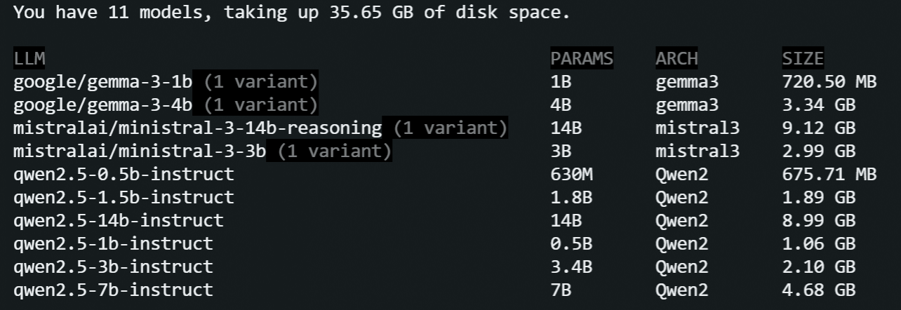
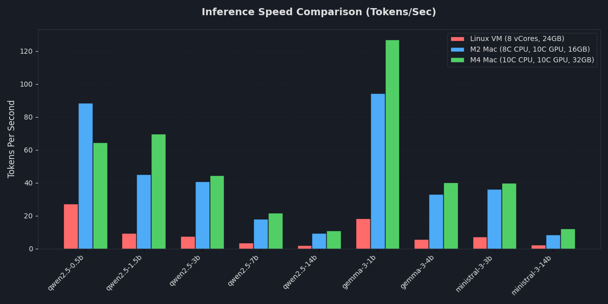
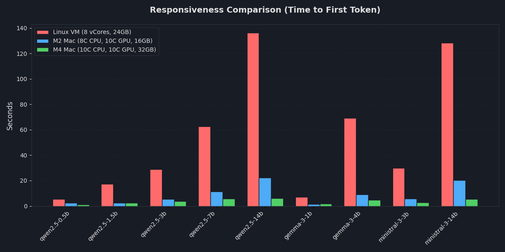

## Running Local LLMs in February 2026

Today I'm investigating inference speed and quality of local LLM models. I'll be running a set of models on a Linux VPS (CPU only, no GPUs) and Apple Silicon (M2 and M4) to gain insights about inference speed, intelligence of models.

Here is what I learned by doing this exercise:

- Local models have improved over time. Last time I checked them (about half a year ago), the quality of the output was suspicious, as was the inference speed.

- Smaller models (up to 3B parameters) still struggle with reasoning but are certainly okay with quality. Maybe my standards are too low, but at least they no longer give me "the capital of Moscow is Russia" when asked "what's the capital of France?"

- The Qwen models are good; I'm impressed by the output quality of the 0.5B model for some use cases. For example, I tested it to check and suggest English grammar, and it was decent. I haven't tested it for code generation, but for text generation, it seems to be ok.

- The inference speed of locally run models on CPU-only machines is good. Again, maybe my expectations were too low, but I certainly see the democratization of local LLMs.

- Mac Minis are solid - I did my tests on cloud Mac instances and am now considering getting a Mac Mini after this exercise. I feel the price/quality ratio for non-Pro versions of Mac Minis is great.

- Mistral's 3B model was the smallest model that passed my simple reasoning test. It wasn't that impressive at AI storytelling, though.

- Long-context ingestion on CPU-only machines is bad. A 2-minute wait for a 14B model to "read" a prompt makes it impractical for interactive chat. The Mac M4's 5-6 second response time keeps the workflow fluid.

- [LM Studio](https://lmstudio.ai/) is nice - easy to download and use models. On a CPU-only machine, it managed memory robustly even for 14B models without crashes.


### The Test Bench
I'm testing nine models across three hardware configurations and the goal is to measure raw speed (`Tokens Per Second`), responsiveness (`Time to First Token`), and logical reasoning capabilities. Models:
- [qwen2.5-0.5b-instruct](https://huggingface.co/Qwen/Qwen2.5-0.5B-Instruct)
- [qwen2.5-1.5b-instruct](https://huggingface.co/Qwen/Qwen2.5-1.5B-Instruct)
- [qwen2.5-3B-Instruct](https://huggingface.co/Qwen/Qwen2.5-3B-Instruct)
- [qwen2.5-7B-Instruct](https://huggingface.co/Qwen/Qwen2.5-7B-Instruct)
- [qwen2.5-14B-Instruct](https://huggingface.co/Qwen/Qwen2.5-14B-Instruct)
- [gemma-3-4b](https://huggingface.co/google/gemma-3-4b-it)
- [gemma-3-1b-it](https://huggingface.co/google/gemma-3-1b-it)
- [ministral-3-3b](https://huggingface.co/mistralai/Ministral-3-3B-Instruct-2512)
- [ministral-3-14b-reasoning](https://huggingface.co/mistralai/Ministral-3-14B-Reasoning-2512)




I'm using [LM Studio](https://lmstudio.ai/) for model management and inference via the `lms` CLI utility, which worked perfectly in headless mode on Linux. On Mac, however, I couldn't get it to work completely headless - I had to install the app and open the UI at least once for the `lms` CLI to function correctly. I’m really impressed with how intuitive and easy is to download and use models with `lms`. Here is a video of it running the `qwen` model: 


### Hardware Specifications

| **Platform**    | **CPU/vCores** | **RAM** | **GPU**  |
| --------------- | -------------- | ------- | -------- |
| **Linux VM**    | 8 vCores       | 24 GB   | None     |
| **Mac M2**      | 8 Cores        | 16 GB   | 10 Cores |
| **Mac Mini M4** | 10 Cores       | 32 GB   | 10 Cores |


## 1. Inference Performance

I was surirised by the inference speed on a CPU-only machine - the small `qwen` models (up to 3 billion parameters) performed quite well. When I last tested `gemma` models locally about 6 months ago, they were slower and worse in output quality than they are today.

Not surprisingly, there was a performance gap between CPU-only and the Mac. The CPU-only machine struggled with inference performance as the parameter count increased.

### Tokens Per Second (TPS)

I used this prompt to measure the TPS:

```
Write a highly detailed, 1,500-word science fiction short story about a civilization living on a Dyson sphere. Focus on the engineering challenges they face and the daily life of a maintenance worker. Be extremely descriptive and do not summarize.
```

#### Results



| **Model**           | **Linux CPU-only, TPS** | **M2 Mac  (16GB RAM), TPS** | **M4 Mac (32GB RAM), TPS** | **Output**                                                                                                                                | **Quality of the generated story\*** |
| ------------------- | ----------------------- | --------------------------- | -------------------------- | ----------------------------------------------------------------------------------------------------------------------------------------- | ------------------------------------ |
| **qwen2.5-0.5b**    | 27.39                   | 88.46                       | 64.53                      | [output.txt](https://raw.githubusercontent.com/samarkanov/Running-Local-LLMs-In-February-2026/refs/heads/main/output/qwen2.5-0.5b.txt)    | 9                                    |
| **qwen2.5-1.5b**    | 9.40                    | 45.06                       | 69.79                      | [output.txt](https://raw.githubusercontent.com/samarkanov/Running-Local-LLMs-In-February-2026/refs/heads/main/output/qwen2.5-1.5b.txt)    | 7                                    |
| **qwen2.5-3b**      | 7.42                    | 40.83                       | 44.40                      | [output.txt](https://raw.githubusercontent.com/samarkanov/Running-Local-LLMs-In-February-2026/refs/heads/main/output/qwen2.5-3b.txt)      | 6                                    |
| **qwen2.5-7b**      | 3.70                    | 18.12                       | 21.58                      | [output.txt](https://raw.githubusercontent.com/samarkanov/Running-Local-LLMs-In-February-2026/refs/heads/main/output/qwen2.5-7b.txt)      | 5                                    |
| **qwen2.5-14b**     | 1.99                    | 9.29                        | 10.98                      | [output.txt](https://raw.githubusercontent.com/samarkanov/Running-Local-LLMs-In-February-2026/refs/heads/main/output/qwen2.5-14b.txt)     | 4                                    |
| **gemma-3-1b**      | 18.45                   | 94.40                       | 126.96                     | [output.txt](https://raw.githubusercontent.com/samarkanov/Running-Local-LLMs-In-February-2026/refs/heads/main/output/gemma-3-1b.txt)      | 3                                    |
| **gemma-3-4b**      | 5.67                    | 33.21                       | 40.25                      | [output.txt](https://raw.githubusercontent.com/samarkanov/Running-Local-LLMs-In-February-2026/refs/heads/main/output/gemma-3-4b.txt)      | 1                                    |
| **ministral-3-3b**  | 7.28                    | 36.32                       | 39.84                      | [output.txt](https://raw.githubusercontent.com/samarkanov/Running-Local-LLMs-In-February-2026/refs/heads/main/output/ministral-3-3b.txt)  | 8                                    |
| **ministral-3-14b** | 2.24                    | 8.51                        | 12.14                      | [output.txt](https://raw.githubusercontent.com/samarkanov/Running-Local-LLMs-In-February-2026/refs/heads/main/output/ministral-3-14b.txt) | 2                                    |
\* The AI-storytelling quality if each model is ranked by a `judge LLM` (`Gemini`), with outputs scored from 1 (the winner) to 9 (the loser). Worth pointing out that none of the models reached the requested 1500-word count - most hovered between 800 and 1100 words. 


### Time to First Token (TTFT)

I used [this prompt](https://raw.githubusercontent.com/samarkanov/Running-Local-LLMs-In-February-2026/refs/heads/main/prompts/ttft.txt) to measure the TTFT, basically I provided a long text and asked the model to process it and signal completion by outputting the word "`READY`" when finished.



| **Model**           | **Linux CPU-only, seconds** | **M2 Mac (16GB RAM), seconds** | **M4 (32GB RAM), seconds** |
| ------------------- | --------------------------- | ------------------------------ | -------------------------- |
| **qwen2.5-0.5b**    | 5.449                       | 2.442                          | 1.116                      |
| **qwen2.5-1.5b**    | 17.484                      | 2.391                          | 2.522                      |
| **qwen2.5-3b**      | 28.946                      | 5.350                          | 3.927                      |
| **qwen2.5-7b**      | 62.468                      | 11.533                         | 5.847                      |
| **qwen2.5-14b**     | 136.175                     | 22.253                         | 6.057                      |
| **gemma-3-1b**      | 7.193                       | 1.467                          | 1.715                      |
| **gemma-3-4b**      | 69.297                      | 9.161                          | 4.903                      |
| **ministral-3-3b**  | 29.750                      | 5.758                          | 2.884                      |
| **ministral-3-14b** | 128.380                     | 20.225                         | 5.554                      |

On the CPU-only machine, I had to wait two minutes for the 14B models to start generating a response, whereas the M4 Mac provided nearly instant responses across the board.


## 2. Intelligence & Logic Test

I used the classic "Sally's Brothers" riddle to test reasoning:

> *Sally has 3 brothers. Each of her brothers has 2 sisters. How many sisters does Sally have?*

There was a notable "intelligence jump" at the 3B-4B parameter mark. The result:

| **Model Name**      | **Result** | **Output Provided** |
| ------------------- | ---------- | ------------------- |
| **qwen2.5-0.5b**    | ❌ Wrong    | 5 sisters           |
| **qwen2.5-1.5b**    | ❌ Wrong    | 5 sisters           |
| **qwen2.5-3b**      | ❌ Wrong    | 5 sisters           |
| **qwen2.5-7b**      | ❌ Wrong    | 5 sisters           |
| **qwen2.5-14b**     | ✅ Correct  | 1 sister            |
| **gemma-3-1b**      | ❌ Wrong    | 2 sisters           |
| **gemma-3-4b**      | ✅ Correct  | 1 sister            |
| **ministral-3-3b**  | ✅ Correct  | 1 sister            |
| **ministral-3-14b** | ✅ Correct  | 1 sister            |

## 3. VRAM Pressure Test
I used [this prompt](https://raw.githubusercontent.com/samarkanov/Running-Local-LLMs-In-February-2026/refs/heads/main/prompts/vram.txt) to run a stress test - I asked the models to sumamrize a sufficiently long text into 10 bullet points. All models were able to complete the task on every machine. While it took a lot more time for bigger models to process the text, no crashes were expirinced. 

